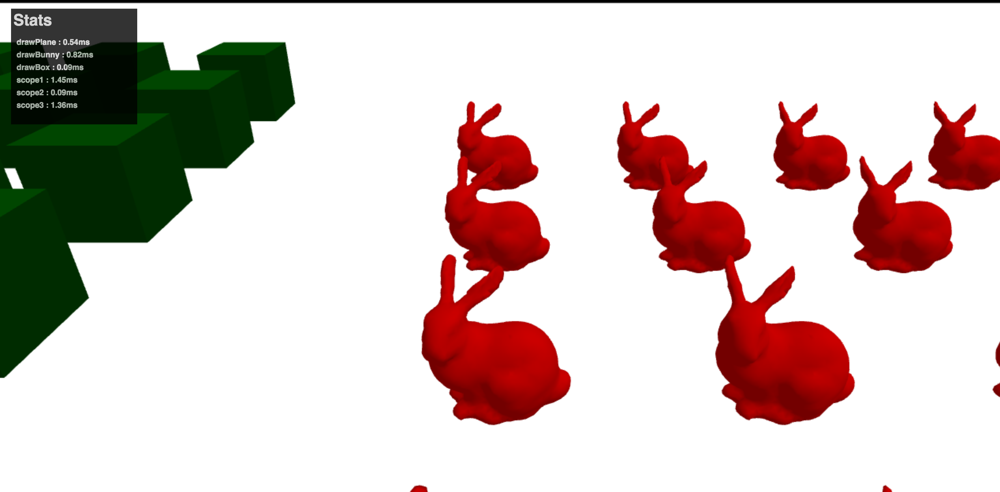

# regl-stats-widget

  
 

This is a small widget that can be used to display how much time is spent doing each drawcall in [regl](https://github.com/mikolalysenko/regl).

An image of the widget can be seen in the upper-left corner below.

